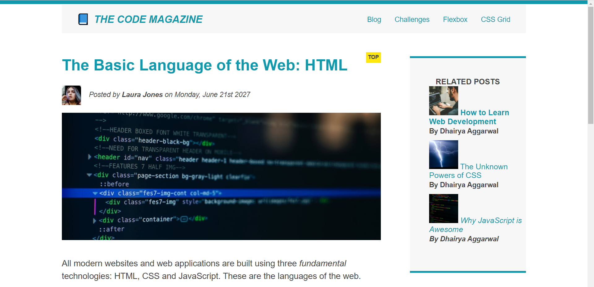

# HTML-CSS-Practice
Learning to build responsive websites, this will contain the files and journey from basic html to responsive website using html and css.

# Developed this using float layout in CSS

